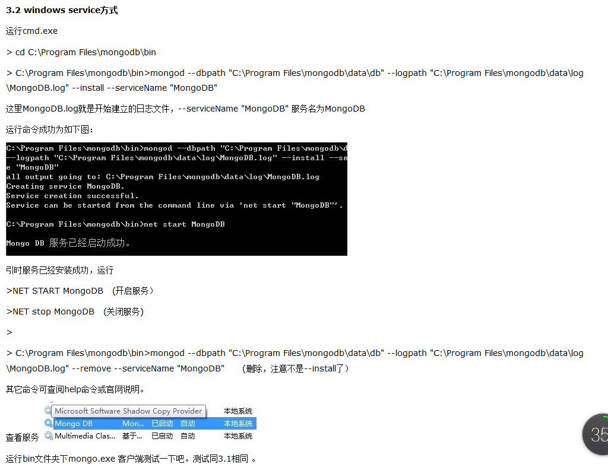

## MongoDB学习（一）

---

### 安装MongoDB

---

#### 一、安装

1、官网下载Mongo安装包

2.解压mongodb-win32-i386-1.8.1.zip ，创建路径C:\Program Files\mongodb ，将解压后的Bin文件Copy to 此文件夹下

3.C:\Program Files\mongodb 下建立Data文件夹 C:\Program Files\mongodb\data ,然后分别建立db,log两个文件夹，至此mongodb下有以下文件夹

C:\Program Files\mongodb\bin

C:\Program Files\mongodb\data\db

C:\Program Files\mongodb\data\log

在log文件夹下创建一个日志文件MongoDB.log，即C:\Program Files\mongodb\data\log\MongoDB.log

完成以上工作后，你为奇怪为什么要建立这些文件夹（因为，Mongodb安装需要这些文件夹，默认安装是不用创建，但是文件都为安装到C:\data\下）

 

4.几种安装方式介绍

4.1 程序启动方式

  运行cmd.exe 进入DOS命中界面

\> cd C:\Program Files\mongodb\bin

\> C:\Program Files\mongodb\bin>mongod -dbpath "C:\Program Files\mongodb\data\db"

执行此命令即将mongodb的数据库文件创建到C:\Program Files\mongodb\data\db 目录，不出意外的会看到命令最后一行sucess的成功提示

此时数据库就已启动，该界面为Mongo的启动程序，关闭后可直接双击bin下的mongod.exe (注意是d，这个是启动程序）

启动程序开启后，再运行mongo.exe 程序（注意没有d)

（服务命令：

mongod -dbpath "D:\InstallationDirectory\MongoDB\data\db" --logpath "D:\InstallationDirectory\MongoDB\data\log\MongoDB.log" --install -serviceName "MongoDB"）