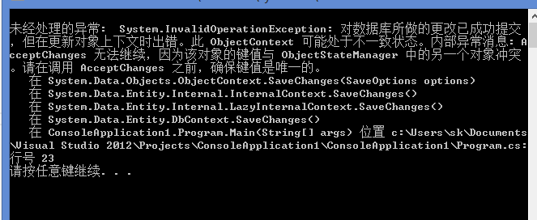
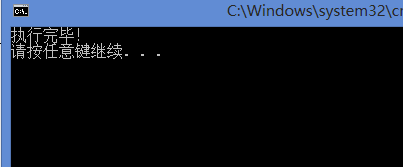

## Orcale 与EF的在数据插入时的问题

---

----建表语句 

```sql
create tbale Test（

ID number(10,0),

name nvarchar2(10),

RQ Date Default sysdate

）;
```


----序列

```sql
create sequence seq_test_ID

increment by 1

start with 1

nomaxvalue

nominvalue

cache 20  ---开启高速缓存
```


 

---触发器

```sql
create or replace trigger tr_test_ID

before insert on Test

for each row

begin

select seq_test_ID.nextval into :new.ID from dual;

end;
```


 

如果上Oracle建表语句（ID为自增长列）

    ```c#
      using (var db = new Entities())
          {
            for (int i = 0; i < 21; i++)
            {
              db.TEST.Add(new TEST
              {
                //ID = i ,注释ID
                NAME = "testaa"+i
              });
              db.SaveChanges();
            }
            
          }
          Console.WriteLine("执行完毕！");
    ```


在EF5里 如果注释上面那行就会发生如下图之类的错误：



 

 

如果将上面代码写成：

```c#
using (var db = new Entities())
      {
        for (int i = 0; i < 21; i++)
        {
          db.TEST.Add(new TEST
          {
            //ID = i,
            NAME = "testaa"+i
          });
        }

 　　　　　db.SaveChanges();     
      }
      Console.WriteLine("执行完毕！");
```


也会发生如上图所示错误但是，数据会被提交到数据库；

如果将上面代码写成如下（即把“//ID = i + 23,”取消注释）

则会打印出“执行成功！”

此处值得考虑的是要确保每次id都不相同，但是EF却不会把ID的值提交到数据库，即数据库的ID依然是序列自增长的；

注：ID只要在每个for循环块内不同即可



